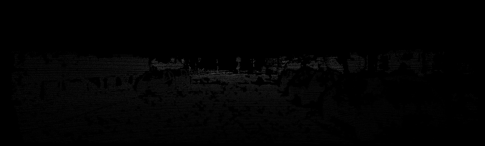
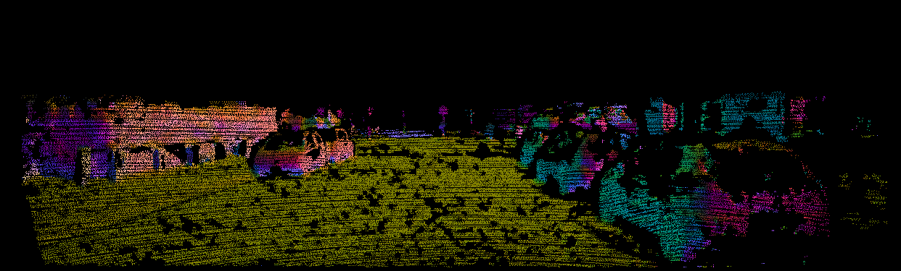

# surface-normal
This is a rewrite of [JiaxiongQ/surface-normal](https://github.com/JiaxiongQ/surface-normal) –
a data preprocessing tool for [JiaxiongQ/DeepLiDAR](https://github.com/JiaxiongQ/DeepLiDAR).

The `calplanenormal()` from the original code is provided as a setup.py-installable Python
library with a single function: `surface_normal.normals_from_depth`.

## Setup

Build and install the library. Requires CMake and OpenCV. 
```bash
python setup.py install
```

## Usage

Takes a depth image (such as the ones provided with the [KITTI depth completion dataset](http://www.cvlibs.net/datasets/kitti/eval_depth.php?benchmark=depth_completion))
as input and outputs estimated normals as an RGB image.
The scale of the depth values does not matter.

```python
from surface_normal import normals_from_depth

# Camera intrinsics
f  = 721.5377
cx = 609.5593
cy = 172.8540
normals_from_depth("depth.png", "normals.png",
    intrinsics=(f, cx, cy),
    window_size=15,
    max_rel_depth_diff=0.1
)
```

### Depth input example 



### Normals output


## Citation
If you use the code or method in your work, please cite the following:  
```
@inproceedings{qiu2018deeplidar,
  title={DeepLiDAR: Deep Surface Normal Guided Depth Prediction for Outdoor Scene from Sparse LiDAR Data and Single Color Image},
  author={Qiu, Jiaxiong and Cui, Zhaopeng and Zhang, Yinda and Zhang, Xingdi and Liu, Shuaicheng and Zeng, Bing and Pollefeys, Marc},
  booktitle={Proceedings of the IEEE Conference on Computer Vision and Pattern Recognition},
  year={2019}
}
```
